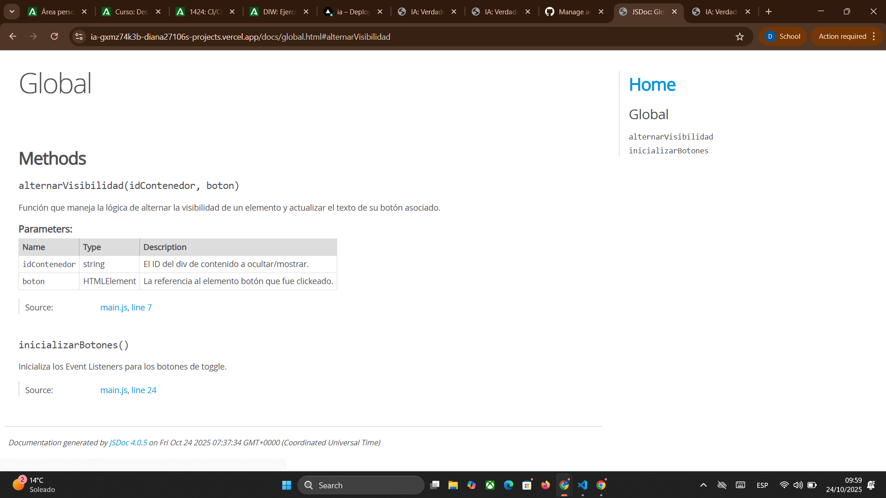
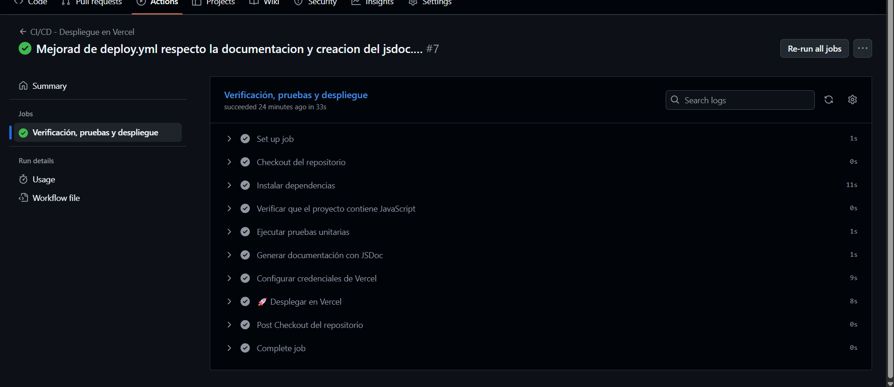

# Entrega – CI/CD: Despliegue en Vercel

## 1️⃣ Información básica

- **Proyecto:** IA
- **Repositorio GitHub:** [https://github.com/Diana27106/ia](https://github.com/Diana27106/ia)
- **Página desplegada (producción):** [https://ia-2teerpkfw-diana27106s-projects.vercel.app/](https://ia-2teerpkfw-diana27106s-projects.vercel.app/)
- **Documentación generada:** [https://ia-2teerpkfw-diana27106s-projects.vercel.app/docs/index.html](https://ia-2teerpkfw-diana27106s-projects.vercel.app/docs/index.html)

---

## 2️⃣ Descripción del flujo de trabajo (GitHub Actions)

Archivo del workflow: `.github/workflows/deploy.yml`
Nombre del workflow: **CI/CD - Despliegue en Vercel**

**Pasos principales:**

1. **Checkout del repositorio**

   ```yaml
   uses: actions/checkout@v4
   ```

   Clona el proyecto en el runner de GitHub Actions.

2. **Instalación de dependencias**

   ```bash
   npm install
   ```

   Instala todas las dependencias del proyecto necesarias para ejecutar pruebas y generar documentación.

3. **Verificación de JavaScript**

   ```bash
   if ! grep -rq "\.js" .; then exit 1; fi
   ```

   Confirma que existen archivos `.js` en el proyecto. Si no los hay, el workflow se detiene.

4. **Ejecución de pruebas unitarias**

   ```bash
   npm test
   ```

   Se ejecutan las pruebas definidas con **Jest**. Si alguna falla, el workflow se detiene.

5. **Generación de documentación con JSDoc**

   ```bash
   mkdir -p docs
   npx jsdoc -c jsdoc.json || true
   ```

   - `jsdoc.json` configurado para **excluir `node_modules`**, evitando errores al parsear librerías externas.
   - Documentación generada en la carpeta `/docs`.

   ```json
   {
     "source": {
       "include": ["js"],
       "exclude": ["node_modules"],
       "includePattern": ".+\\.js$"
     },
     "opts": {
       "destination": "docs",
       "recurse": true
     }
   }
   ```

6. **Configuración de Vercel**

   ```bash
   npm install -g vercel
   vercel --version
   ```

   - Se instala la CLI de Vercel para poder desplegar desde GitHub Actions.
   - **Token de Vercel:** Se debe crear en [Vercel → Settings → Tokens] y añadir como **secret** en GitHub (`Settings → Secrets → Actions → VERCEL_TOKEN`).

7. **Despliegue en Vercel**

   ```bash
   vercel --prod --yes --token ${{ secrets.VERCEL_TOKEN }}
   ```

   - `--prod` despliega directamente a producción.
   - `--yes` evita confirmaciones interactivas.
   - `--token` usa el token seguro almacenado en GitHub Actions.

---

## 3️⃣ Scripts en `package.json`

```json
"scripts": {
    "test": "jest",
    "doc": "jsdoc -r -d docs ."
}
```

- `npm test` → ejecuta las pruebas unitarias con Jest.
- `npm run doc` → genera la documentación con JSDoc.

---

## 4️⃣ Evidencias

- **GitHub Actions:** workflow ejecutado con todos los pasos completados ✅
- **Página web en producción:** enlace arriba
- **Documentación generada:** enlace arriba





---

## 5️⃣ Observaciones

- Las pruebas unitarias se ejecutan correctamente en GitHub Actions.
- JSDoc genera documentación solo de tus archivos, ignorando `node_modules` para evitar errores.
- Despliegue automático en Vercel cada push a `main`.
